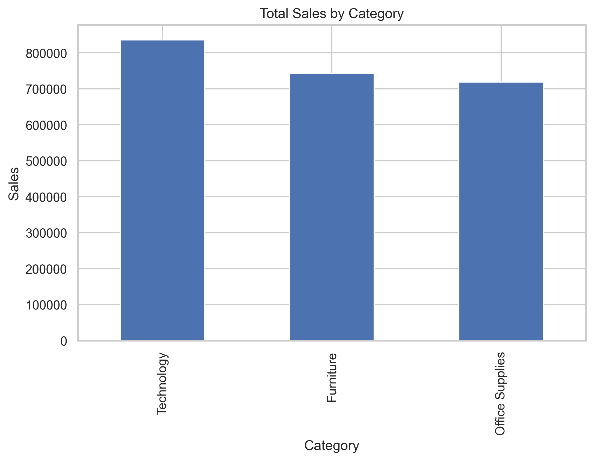
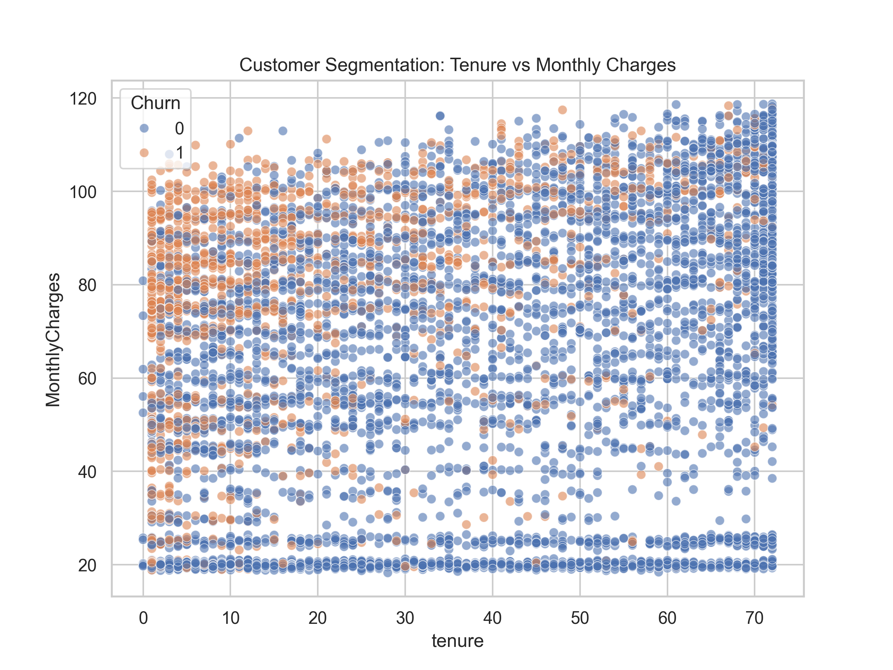

# Data Analyst Portfolio


---

## About Me

I am passionate about **data analysis, visualization, and data-driven decision making**.

This portfolio demonstrates my ability to:

- analyze real-world datasets
- build clear visualizations
- generate actionable business insights
- build interactive dashboards for data exploration

The projects focus on **exploratory data analysis (EDA), business intelligence, customer analytics, and job market research**.

---

## Portfolio Projects

### Project Overview

| Project | Description | Tools |
|---|---|---|
| **Sales Performance Dashboard** | Retail sales analysis identifying revenue drivers and profit patterns | Python, Pandas, Matplotlib |
| **Customer Churn Analysis** | Telecom customer churn analysis identifying high-risk customer segments | Python, Pandas, Seaborn |
| **AI & Data Science Job Market** | Interactive dashboard exploring salary trends and hiring patterns across the global AI job market 2020–2026 | Python, Pandas, Plotly, Streamlit |

---

## Quick Navigation

| Project | Link |
|---|---|
| Sales Dashboard | [Open Project](projects/sales-dashboard/README.md) |
| Customer Churn Analysis | [Open Project](projects/customer-churn-analysis/README.md) |
| AI & Data Science Job Market | [Open Project](projects/ai-job-market-analysis/README.md) · [Live Demo](https://your-app-url.streamlit.app) |

---

## 1. Sales Performance Dashboard

Retail sales analysis project focused on understanding **sales performance, profit distribution, and product performance**.

### Key Analysis Areas

- Sales by category
- Profit by region
- Monthly sales and profit trends
- Top-performing products
- Impact of discount on profitability

### Tools Used

Python · Pandas · Matplotlib · Seaborn · Jupyter Notebook

### Key Insight

Technology products generate the highest revenue, while excessive discounting often reduces profitability.

### Visualization Preview



Project Link: [Open Project 1: Sales Performance Dashboard](projects/sales-dashboard/README.md)

---

## 2. Customer Churn Analysis

Customer churn analysis project focused on identifying **factors influencing customer retention**.

### Key Analysis Areas

- Customer churn distribution
- Churn by contract type
- Churn by tenure
- Monthly charges vs churn
- Customer risk segmentation
- Feature correlation analysis

### Tools Used

Python · Pandas · Matplotlib · Seaborn · Jupyter Notebook

### Key Insight

Customers with **month-to-month contracts, shorter tenure, and higher monthly charges** show a significantly higher churn probability.

### Visualization Preview



Project Link: [Open Project 2: Customer Churn Analysis](projects/customer-churn-analysis/README.md)

---

## 3. AI & Data Science Job Market Dashboard

Interactive data visualization dashboard exploring **salary trends, role distributions, and hiring patterns** across the global AI & Data Science job market from 2020 to 2026.

### Key Analysis Areas

- Salary trends by year, experience level, and company size
- Top job titles and role distribution
- Geographic hiring patterns across 6 countries
- Remote vs hybrid vs on-site adoption over time
- Most in-demand technical skills and salary premiums

### Tools Used

Python · Pandas · Plotly · Streamlit · Jupyter Notebook

### Key Insight

**Cloud skills** (AWS, GCP, Azure) and **ML frameworks** (TensorFlow, Scikit-learn) carry the highest salary premiums. Remote roles now dominate the market across all experience levels.

### Live Demo

[View Dashboard](https://ai-job-market-2026.streamlit.app)

Project Link: [Open Project 3: AI & Data Science Job Market](projects/ai-job-market-analysis/README.md)

---

## Repository Structure

```text
data-analyst-portfolio/
├── projects/
│   ├── sales-dashboard/
│   │   ├── data/
│   │   ├── dashboard_images/
│   │   ├── sales_dashboard_analysis.ipynb
│   │   └── README.md
│   ├── customer-churn-analysis/
│   │   ├── data/
│   │   ├── images/
│   │   ├── churn_analysis.ipynb
│   │   └── README.md
│   └── ai-job-market-analysis/
│       ├── dashboard/
│       │   └── app.py
│       ├── data/
│       ├── images/
│       ├── notebooks/
│       │   └── ai_job_market_eda.ipynb
│       ├── requirements.txt
│       └── README.md
└── README.md
```