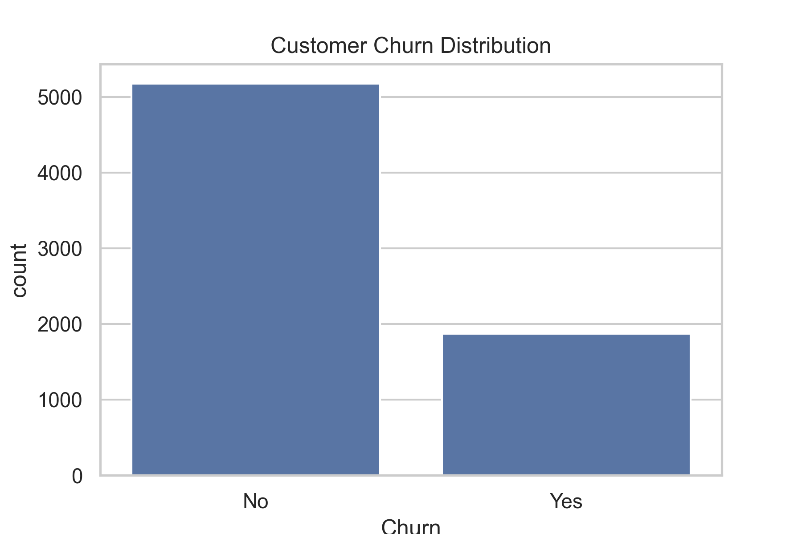
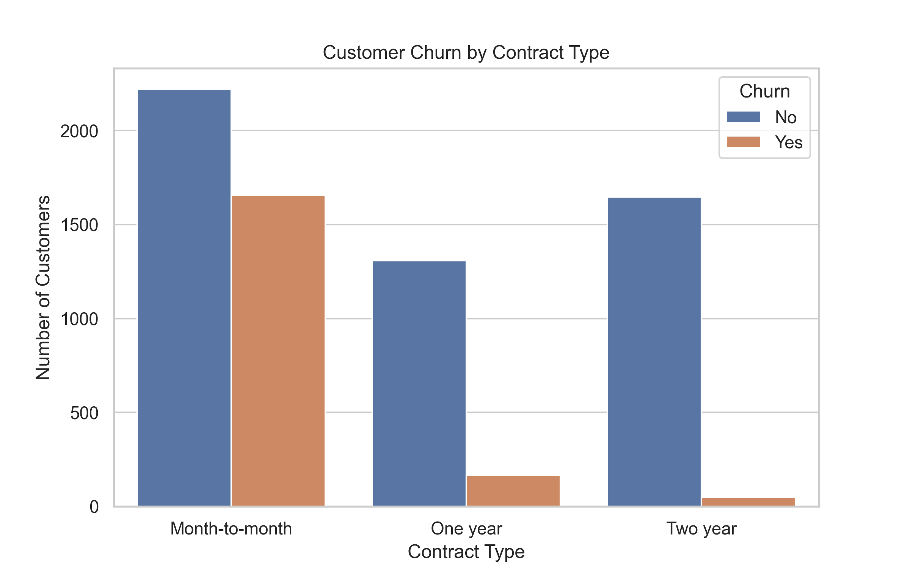
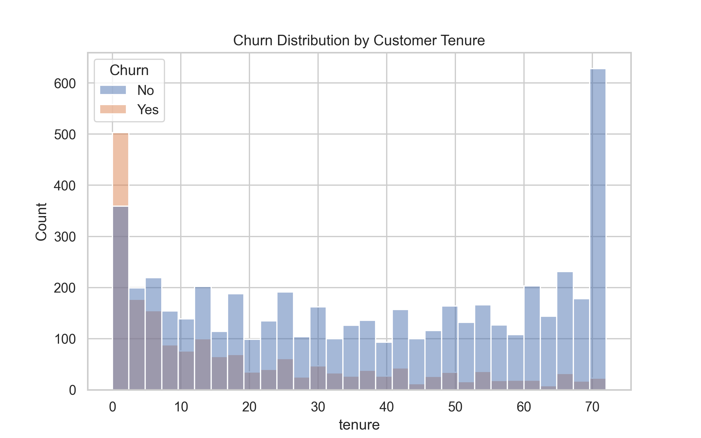
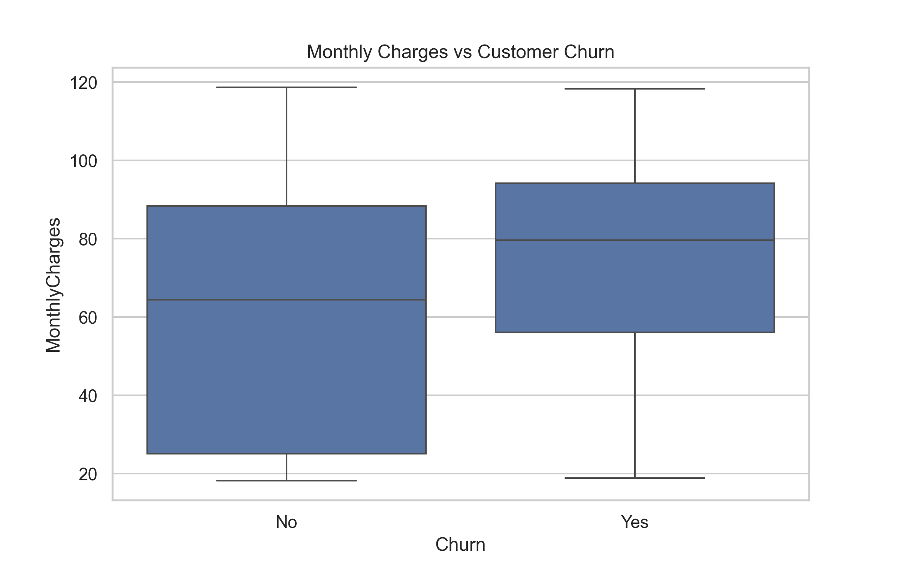
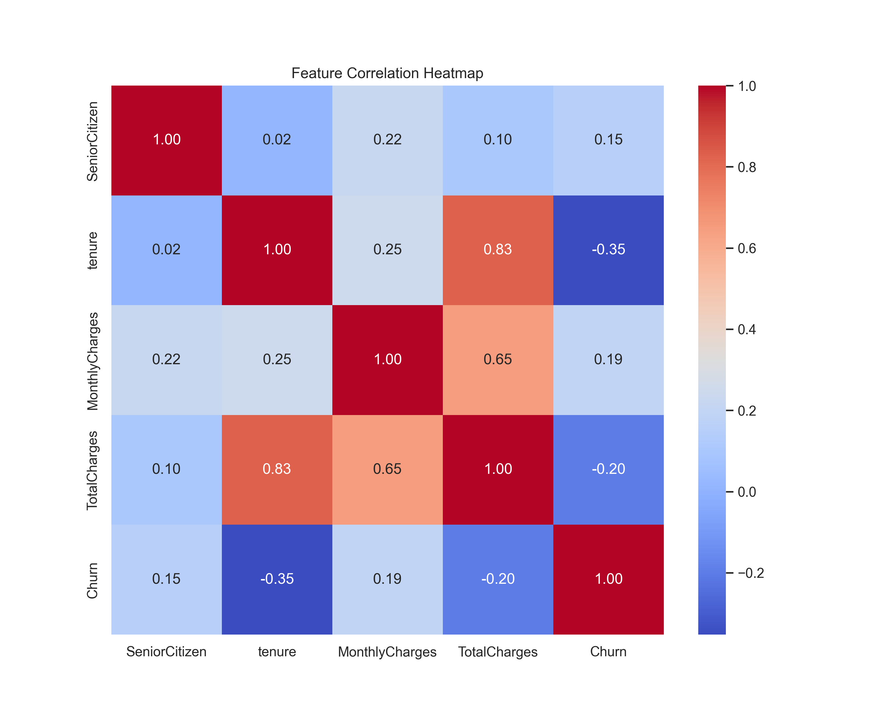

# Customer Churn Analysis

## Executive Summary

Customer churn is a major challenge for subscription-based businesses. Understanding why customers leave is essential for improving retention and long-term profitability.

This project analyzes a telecom customer dataset to identify key factors related to churn. The analysis reveals that customers with **month-to-month contracts, shorter tenure, and higher monthly charges** are more likely to leave the service.

These insights can help companies design **data-driven strategies to improve customer retention, optimize pricing, and target high-risk customer segments**.

---

## Project Overview

This project explores patterns of customer churn using the Telco Customer Churn dataset. The goal is to identify customer characteristics associated with higher churn risk and provide actionable business insights.

The analysis focuses on:

- Customer contract types  
- Customer tenure  
- Monthly charges  
- Internet service types  
- Payment methods  

Through exploratory data analysis and visualization, the project highlights key drivers of churn behavior.

---

## Business Questions

This analysis aims to answer the following questions:

- What is the overall churn rate?
- Which contract types have the highest churn?
- Are new customers more likely to churn?
- Does pricing influence churn behavior?
- Are certain services or payment methods associated with higher churn risk?

---

## Tools Used

Python  
Pandas  
Matplotlib  
Seaborn  
Jupyter Notebook  

---

## Dataset

**Telco Customer Churn Dataset**

https://www.kaggle.com/datasets/blastchar/telco-customer-churn

The dataset contains information about telecom customers, including:

- Customer tenure
- Contract type
- Internet service
- Monthly charges
- Total charges
- Payment method
- Customer churn status

Target variable:

`Churn (Yes / No)`

---

## Key Metrics

| Metric | Value |
|------|------|
| Total Customers | ~7,000 |
| Churned Customers | ~1,800 |
| Churn Rate | ~26% |

---

## Visual Analysis

### Customer Churn Distribution



This chart shows the overall distribution of customers who stayed versus those who churned.

---

### Churn by Contract Type



Customers with **month-to-month contracts** show significantly higher churn compared with customers with longer-term contracts.

---

### Churn by Customer Tenure



Customers with shorter tenure are more likely to churn, indicating that the early stage of the customer lifecycle is critical for retention.

---

### Monthly Charges vs Churn



Customers paying higher monthly charges appear slightly more likely to churn.

---

### Customer Risk Segmentation


Customers with **low tenure and higher monthly charges** represent a potential high-risk churn segment.

---

### Feature Correlation Heatmap



The correlation heatmap highlights relationships between numerical variables such as tenure, monthly charges, and total charges.

---

## Key Insights

- Customers with **month-to-month contracts** have the highest churn rates.
- **New customers** are significantly more likely to churn than long-term customers.
- **Higher monthly charges** are associated with increased churn risk.
- Service and payment characteristics influence customer retention patterns.

---

## Business Recommendations

Based on the analysis, several strategies could help reduce churn:

**Encourage long-term contracts**  
Providing incentives for customers to switch from month-to-month plans to annual contracts may improve retention.

**Focus on early customer engagement**  
Since churn is highest among new customers, onboarding programs and early customer support could help improve retention.

**Review pricing strategies**  
Customers with higher monthly charges appear more likely to churn, suggesting that pricing and perceived value should be evaluated.

**Target high-risk segments**  
Customers with short tenure and higher monthly charges should be prioritized for retention campaigns.

---

## Project Structure
```text
customer-churn-analysis
│
├── data
│ └── telco_churn.csv
│
├── images
│ ├── churn_distribution.png
│ ├── churn_by_contract.png
│ ├── churn_by_tenure.png
│ ├── churn_by_charges.png
│ ├── churn_by_internet_service.png
│ ├── churn_by_payment_method.png
│ ├── customer_risk_segmentation.png
│ └── churn_correlation.png
│
├── churn_analysis.ipynb
└── README.md

