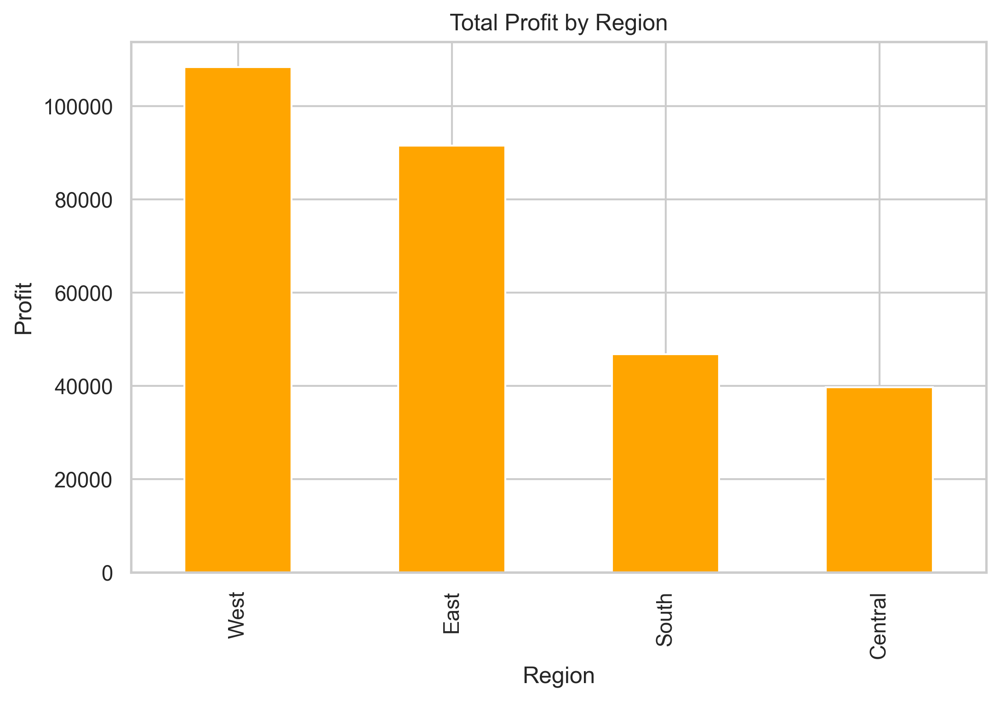
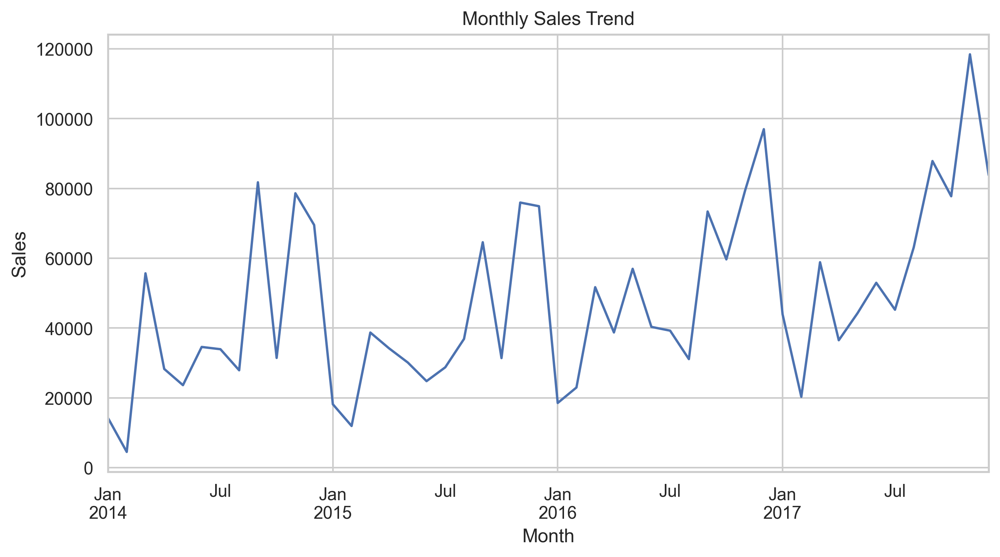
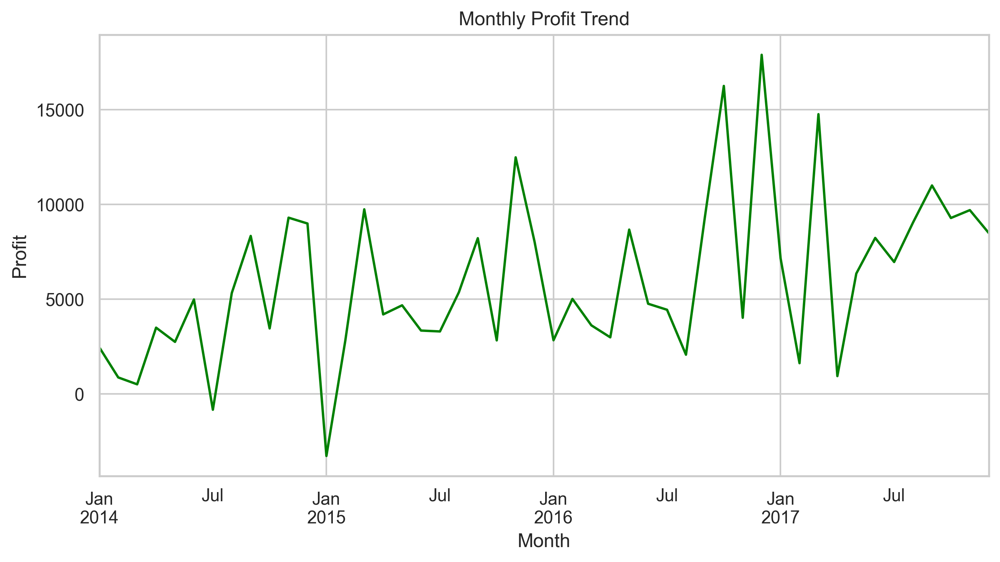
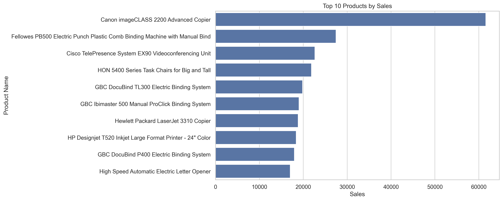
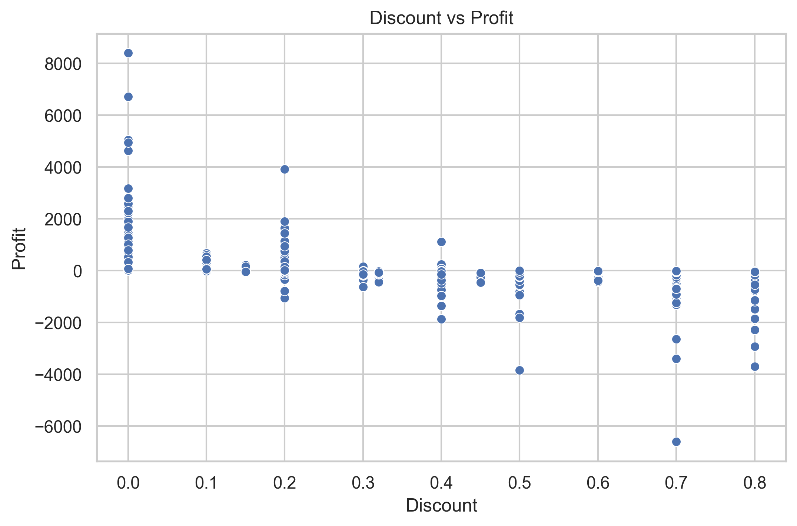

# Sales Performance Dashboard

## Project Overview

This project analyzes the Superstore dataset to evaluate company
performance in terms of sales, profit, and product performance.

The goal is to identify key business drivers and provide insights
through data visualization.

---

## Business Questions

This analysis focuses on the following questions:

• Which product categories generate the most sales and profit?  
• Which regions perform best in terms of profitability?  
• How do sales evolve over time?  
• Which products drive the highest revenue?  
• How does discounting impact profitability?

---

## Tools Used

Python  
Pandas  
Matplotlib  
Seaborn  
Jupyter Notebook

---

## Dataset

Superstore Dataset (Retail sales dataset)

Key columns include:

• Order Date  
• Region  
• Category  
• Product Name  
• Sales  
• Profit  
• Discount  

---

## Key KPIs

| Metric | Value      |
|------|------------|
| Total Sales | $2,297,200 |
| Total Profit | $286,397   |
| Total Orders | 5,009      |

---

## Visual Analysis

### Sales by Category

Technology generates the highest revenue among all categories.

---

### Profit by Region

The West region contributes the highest profit.

---

### Monthly Sales Trend

Sales fluctuate over time with visible seasonal patterns.

---

### Monthly Profit Trend

Profit trends follow similar seasonal dynamics.

---

### Top 10 Products by Sales

A small number of products generate a large portion of total revenue.

---

### Discount vs Profit

Higher discount levels are often associated with lower profitability.

---

## Key Insights

• Technology is the most profitable category.  

• The West region generates the highest profit.  

• Sales and profits show seasonal fluctuations.  

• A small number of products drive a large share of revenue.  

• Excessive discounting can negatively affect profit.

---

## Project Structure
